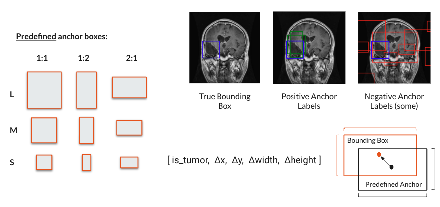
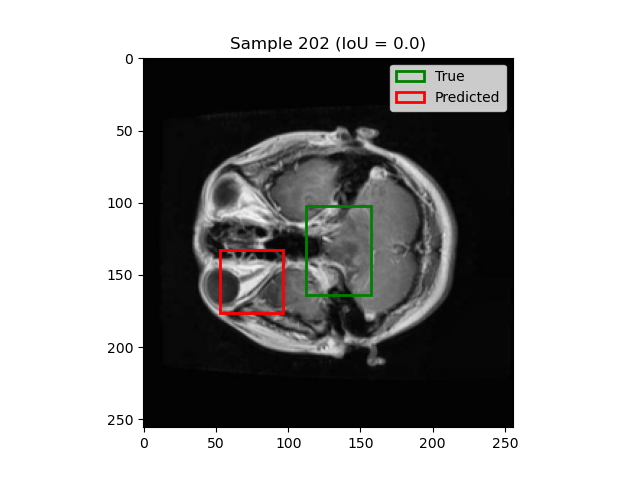

# Brain Tumor Detection with Computer Vision

This work aims to identify the location of brain tumors in MRI images through the use of object-detection.

These are personal contributions and continuations of a group project for CS4100. You can find the project report [here](./resources/Project_Report.pdf).

## Datasets

The datasets used in this project are available on Kaggle:

- [Brain Tumor Image Dataset: Semantic Segmentation](https://www.kaggle.com/datasets/pkdarabi/brain-tumor-image-dataset-semantic-segmentation)


## Problem Formulation

### Single Object Detection

Directly predict the coordinates of the ground truth bounding box (center of the box and its width, height).

Benefit: simple and naive approach

Drawbacks: relies on the assumption that there is exactly 1 tumor bounding box per image


### Anchor-based Object Detection

Pre-define anchors boxes of various sizes and aspect ratios. For each anchor box, make a classification prediction (is there an object in this anchor?) and a regression prediction (how to make the anchor box overlay the true object bounding box).

Benefits: can handle cases when there are no tumors or many tumors in a single image

Drawbacks: more difficult to train due to spacity of the labels; more complicated model architecture.



## Setup Instructions

### Step 1: Install Dependencies

Install the necessary Python packages using the requirements.txt file:

```bash
pip install -r requirements.txt
```

Alternatively, you can create a conda environment using the following commands:

```bash
conda env create -f environment.yaml
conda activate brain_tumor_detection_env
```

### Step 2: Setup Environment Variables

To create a base configuration for the project, run the following command:

```bash
cp config/env_local.env .env
```

This will create a `.env` file in the root dir of the project. However, to actually run training and testing scripts, you will need to fill in the values in the `.env` file.

### Step 3: Kaggle API Authentication

Follow the instructions to set up your Kaggle API credentials. You can find the Kaggle API authentication instructions in the [Kaggle API Documentation](https://www.kaggle.com/docs/api).

### Step 4: Download Datasets

Refer to the `notebooks/downloading_datasets.ipynb` notebook for step-by-step instructions on using the Kaggle API to download the datasets required for this project. The datasets will be downloaded to the `./datasets` folder, which is configured to be ignored by git.

## Running Experiments:

### Single Object Detection

Navigate to the `main` function in [`src.training.train_single_object_detection`](./src/training/train_single_object_detection.py) and edit the `training_configs`.

TrainingConfig Arguments:

- dataset_root_dir
- device
- batch_size
- learning_rate
- num_epochs
- optimizer ("Adam" or "SGD")
- image_size
- pretrained_backbone (True or False)
- efficient_net_version: ("b0", ... "b7")
- predictor_hidden_dims (e.g. [[64, 16])

To run the specified experiment you can use...

```bash
python -m src.training.train_single_object_detection
```

### Anchor-Based Object Detection

## Some Experimental Results

### Single Object Detection

Experimental Configs:

```json
{
  "batch_size": 16,
  "learning_rate": 0.001,
  "num_epochs": 100,
  "device": "mps",
  "dataset_root_dir": "./datasets",
  "augmentations": ["rotation", "reflection", "crop"],
  "optimizer": "Adam",
  "image_size": 256,
  "pretrained_backbone": true,
  "efficient_net_version": "b4",
  "predictor_hidden_dims": [64, 16],
  "save_dir_path": "./experiments/24-05-31-01-09",
  "git commit id": "ff97464a381f489a97e7730756a276446a4a03ac"
}
```

Experimental Results:

```json
{
  "best_val_iou": 0.6572,
  "best_epoch": 67,
  "test_iou": 0.642
}
```

Example Test Predictions:


 

 

 


